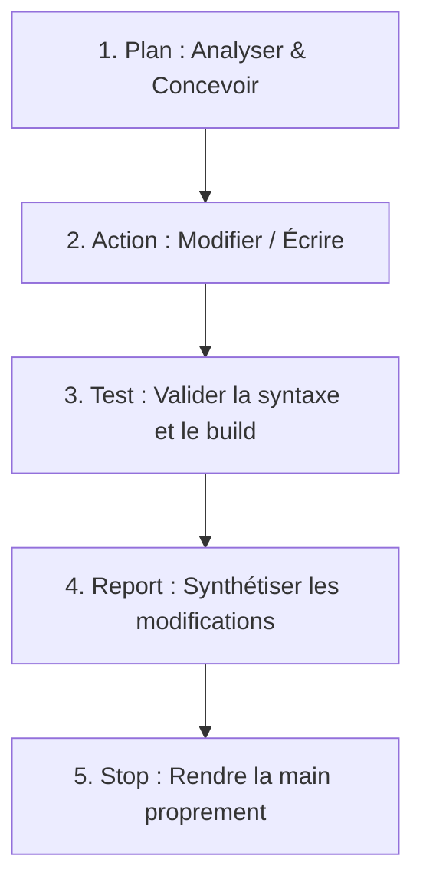

# 🤖 Agent Operating System — Entry Point

Bienvenue, agent IA (Claude Code, Gemini, Copilot, etc.). Ce document est votre point d'entrée principal sur le dépôt **MentorBot Evolution**. Lisez-le attentivement avant d'exécuter des outils ou de modifier le code.

---

## 📌 Vue d'ensemble du Projet
**MentorBot Evolution** est une plateforme d'apprentissage moderne basée sur l'IA et les neurosciences, conçue pour optimiser la préparation au test du TOEIC (objectif 800+ points).

- **Frontend** : Application SPA React 18 construite avec Vite, styled avec TailwindCSS et Radix UI / Shadcn.
- **Backend** : API Flask en Python 3.11/3.12 connectée à SQLite (développement/tests) ou PostgreSQL (production), sécurisée via JWT.
- **IA/Neurosciences** : Analyse sémantique de documents via OCR (Tesseract) et NLP (Regex/Fréquence), associée à un algorithme de répétition espacée adaptatif (**SM-2**).

---

## 🗂️ Index de la Documentation
Pour approfondir et comprendre les règles opérationnelles, consultez les documents suivants :
1. **[Règles et Comportement de l'Agent (docs/AGENTS.md)](file:///c:/Users/mabia/OneDrive/Desktop/03_PROJETS-TECH/Projets-Dev-Perso/mentor%20evolution/docs/AGENTS.md)** : Pièges à éviter absolument (Known traps), pair-programming.
2. **[Stratégie d'Optimisation des Tokens (docs/TOKEN_STRATEGY.md)](file:///c:/Users/mabia/OneDrive/Desktop/03_PROJETS-TECH/Projets-Dev-Perso/mentor%20evolution/docs/TOKEN_STRATEGY.md)** : Comment consommer moins de contexte.
3. **[Architecture Technique Globale (docs/ARCHITECTURE.md)](file:///c:/Users/mabia/OneDrive/Desktop/03_PROJETS-TECH/Projets-Dev-Perso/mentor%20evolution/docs/ARCHITECTURE.md)** : Structure des dossiers, flux de données, modèles DB.
4. **[Registre des Décisions d'Architecture (docs/DECISIONS/)](file:///c:/Users/mabia/OneDrive/Desktop/03_PROJETS-TECH/Projets-Dev-Perso/mentor%20evolution/docs/DECISIONS)** : Fiches ADR détaillant les orientations techniques (Flask vs FastAPI, SQLite vs Postgres, etc.).

---

## 🔄 Agent Loop Protocol
Vous devez impérativement suivre cette boucle d'actions pour chaque tâche :



1. **Plan** : Effectuer des recherches ciblées, comprendre l'existant, formuler un plan clair et le soumettre à l'utilisateur si complexe.
2. **Action** : Réaliser les modifications avec des outils d'édition précis (par exemple, remplacer des blocs contigus plutôt que réécrire des fichiers entiers).
3. **Test** : Lancer systématiquement la suite de tests et de compilation (voir commandes ci-dessous).
4. **Report** : Documenter succinctement les modifications dans un Walkthrough sans paraphraser les fichiers.
5. **Stop** : Terminer le tour de parole de manière nette.

---

## 🛠️ Commandes Officielles de Validation

Avant de soumettre une modification, exécutez ces commandes de validation :

### Backend (Python)
- **Compilation globale** (validation syntaxique) :
  ```bash
  python -m compileall main.py src api backend tests
  ```
- **Tests unitaires et intégration** :
  ```bash
  python -m pytest -q
  ```

### Frontend (Node.js)
- **Analyse statique (Linting)** :
  ```bash
  npm run lint
  ```
- **Construction de production (Build)** :
  ```bash
  npm run build
  ```
