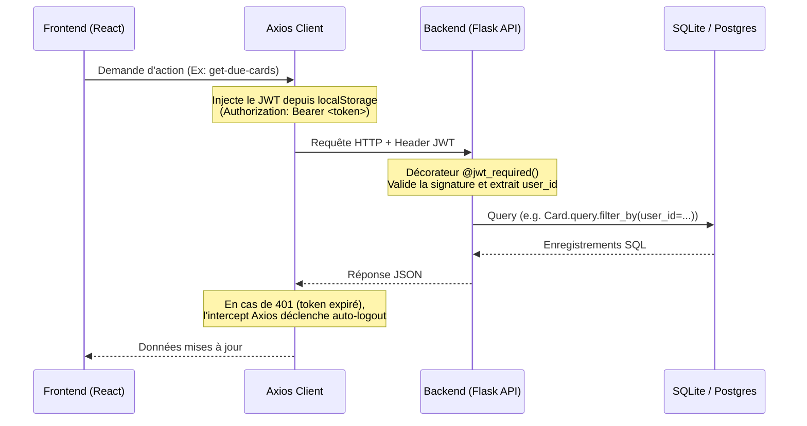

# 🏗️ Architecture Technique — MentorBot Evolution

Ce document détaille l'architecture logicielle, le flux de données et la structure de la plateforme **MentorBot Evolution**.

---

## 📂 Structure du Projet

```
mentor-bot-evolution/
├── AGENT_CONTEXT.md          # Point d'entrée pour les agents IA
├── docs/                     # Documentation technique & ADRs
│   ├── ARCHITECTURE.md       # Ce fichier
│   ├── AGENTS.md             # Règles comportementales des agents
│   ├── TOKEN_STRATEGY.md     # Optimisation des tokens
│   └── DECISIONS/            # Architectural Decision Records (ADRs)
├── api/
│   └── index.py              # Point d'entrée serverless pour Vercel (importe main.py)
├── src/                      # Code source principal (Frontend & Backend)
│   ├── components/           # Composants React (Shadcn/UI)
│   │   ├── ui/               # Composants atomiques réutilisables (Button, Card, etc.)
│   │   └── MasteryPlan/      # Composants métiers (Dashboard, Plan, Validation, Spaced)
│   ├── context/              # Contextes React (AuthContext)
│   ├── models/               # Modèles de base de données SQLAlchemy (user.py)
│   ├── routes/               # Blueprints Flask (user, analysis, spaced_repetition, mastery, learning)
│   ├── services/             # Services métiers (learning_pipeline, concept_extraction, flashcard_generation)
│   ├── utils/                # Utilitaires backend (OCR, NLP) et frontend (API client)
│   ├── App.jsx               # Composant React racine
│   ├── index.css             # Styles Tailwind globaux
│   └── main.jsx              # Point d'entrée du frontend React
├── tests/                    # Suite de tests d'intégration backend
│   └── backend_test.py
├── main.py                   # Serveur Flask racine
├── vercel.json               # Config de déploiement Vercel
└── package.json              # Dépendances npm et scripts de build
```

---

## 🔄 Flux de Données & Authentification

L'application est construite sur un modèle client-serveur classique :



---

## 🧠 Couplage Algorithmique : Apprentissage & Répétition Espacée

L'application intègre de manière étroite trois concepts pour optimiser la mémorisation :

1. **Générateur de Plan (`PlanGenerator`)** :
   - L'utilisateur charge un document (PDF/Image/Texte) ou saisit des notions.
   - Le backend extrait les concepts (via OCR & NLP fréquentiel) et crée un **Subject** ainsi que des **Concept**s en base de données.
   - Pour chaque concept, une **Card** de répétition espacée est créée.
2. **Validation Feynman (`ValidationChecklist`)** :
   - L'utilisateur auto-évalue sa compréhension du concept (explications dans ses propres mots, score d'exercices, score de confiance).
   - Un appel est fait vers `/api/analysis/update-progress` qui met à jour la maîtrise du concept en base de données et crée une `StudySession`.
3. **Mise à jour SM-2** :
   - L'évaluation Feynman du concept recalcule l'intervalle de révision et le facteur de facilité de la **Card** associée via l'algorithme **SM-2** :
     - Si le taux de réussite ou de mémorisation est élevé, la prochaine révision est planifiée à plusieurs jours/semaines.
     - Si la compréhension ou confiance est faible, la prochaine révision est rapprochée (intervalle = 1 jour).

---

## 🗄️ Modèles de Base de Données

Les modèles SQLAlchemy sont définis dans `src/models/user.py` :
- **User** : Informations d'authentification et relations avec les matières, cartes et sessions.
- **Subject** : Représente une matière (ex: "TOEIC Objective 850") et contient plusieurs concepts.
- **Concept** : Une notion spécifique au sein d'une matière avec un score de maîtrise (0-100) et un statut (`completed`, `in-progress`, `not-started`).
- **Card** : Carte mémoire pour l'algorithme de répétition espacée (conserve `interval`, `easiness_factor` et `next_review`).
- **StudySession** : Enregistrement de session de travail (durée, précision) utilisé pour générer les graphiques d'analytics de progression.

---

## ⛓️ Pipeline d'Apprentissage (Learning Pipeline Core)

Le pipeline d'apprentissage structure le flux d'analyse de documents et de génération de contenu pédagogique en 6 étapes :

1. **Document** : L'utilisateur importe un document (PDF/Image/Texte) via l'interface.
2. **Extraction** : Le module `src/utils/document_extraction.py` extrait le texte brut de manière résiliente.
3. **Concepts** : Le service `src/services/concept_extraction.py` analyse la fréquence et la structure pour identifier les notions clés avec un score de confiance.
4. **Flashcards** : Le service `src/services/flashcard_generation.py` crée des questions/réponses adaptées pour chaque concept.
5. **Révision espacée** : Le pipeline planifie un calendrier de révisions (`revision_plan`) basé sur des intervalles exponentiels.
6. **Progression** : Les révisions successives alimentent les statistiques de maîtrise persistées en base de données.

Le pipeline est coordonné par le service central `src/services/learning_pipeline.py` et exposé via le champ `pipeline` dans la route d'analyse `/api/analysis/analyze-document`.

