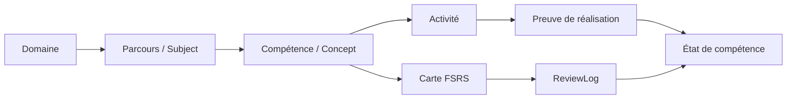

# Architecture cible — Mentor Evolution multi-domaines

**Auteur : Manus AI**  
**Date : 11 août 2026**

## Intention

Mentor Evolution devient une plateforme personnelle de **maîtrise de compétences**. Un parcours TOEIC reste une configuration spécialisée ; il ne définit plus les champs, les écrans ou les mécanismes utilisés par l’informatique, Excel, Power BI, le réseau ou la cybersécurité. Le moteur de répétition FSRS demeure partagé, car il planifie la réactivation des connaissances à long terme. Les compétences appliquées sont, elles, attestées par des activités et preuves adaptées au domaine.

> Une revue FSRS est une observation de rappel. Elle ne constitue pas, seule, une preuve d’exécution, de diagnostic ou de production professionnelle.

## Modèle cible

| Niveau | Rôle | Première implémentation |
|---|---|---|
| Domaine | Regroupe des parcours partageant vocabulaire, sources et formes de pratique. | Valeurs contrôlées : `language`, `computing`, `productivity`, `data`, `infrastructure`, `security`, `general`. |
| Parcours | Représente une intention personnelle : TOEIC, fondamentaux informatiques, Excel, réseau, Power BI ou cybersécurité. | Extension de `Subject` avec domaine, type d’objectif, libellé, échéance facultative et charge hebdomadaire. |
| Compétence | Unité que l’on cherche à comprendre et à appliquer. | Extension légère de `Concept` avec type : connaissance, procédure, production, diagnostic ou communication. |
| Activité | Exercice qui rend la compétence observable. | Nouveau modèle à préparer après le socle : rappel, explication, quiz, exercice pratique, diagnostic ou projet. |
| Preuve | Résultat vérifiable d’une activité. | Première version textuelle/URL/document ; pas de promesse de correction automatique. |
| Carte FSRS | Support de réactivation d’une notion. | Modèle et journal existants préservés. |

## Contrat de parcours

Chaque parcours créé par l’utilisateur doit exposer les éléments suivants : un domaine, un intitulé, un objectif formulé, une échéance facultative, un rythme hebdomadaire réaliste, des compétences et les types de pratique à privilégier. Le champ historique `target_score` est maintenu pour la compatibilité ; il n’est renseigné que pour un examen doté d’une échelle explicite, comme le TOEIC.

Les paramètres « style d’apprentissage », « chronotype » et « probabilité de réussite » sont retirés. Ils ne représentent pas des mesures personnelles fiables. Le plan utilisera plutôt les préférences d’activité déclarées, la disponibilité et les données de pratique effectivement observées.

## Premier incrément à livrer

| Élément | Décision |
|---|---|
| Catalogue de parcours | Un catalogue local transparent : TOEIC, fondamentaux de l’informatique, Excel, Power BI, réseau, cybersécurité et parcours libre. Aucun parcours n’est créé automatiquement. |
| API | Exposer le catalogue et créer un parcours sur action explicite de l’utilisateur. Les contenus de départ sont déclarés comme modèles éditoriaux, jamais comme analyse de fichier ou diagnostic personnel. |
| Modèle | Ajouter à `Subject` : domaine, type/libellé d’objectif, date cible, heures hebdomadaires, source du parcours et niveau de preuve. Ajouter à `Concept` : type de compétence et critère de preuve. |
| Interface | Remplacer les réglages TOEIC et les styles d’apprentissage par un assistant de création de parcours ; le tableau de bord présente tous les parcours à égalité. |
| Premier parcours technique | « Fondamentaux de l’informatique » : systèmes et données, algorithmique, système d’exploitation, réseau, sécurité de base. Il fournit des notions structurantes ; les activités pratiques viendront au second incrément. |
| Sécurité | Les futurs parcours cybersécurité se limitent à des concepts et à des laboratoires autorisés. Aucun scénario d’intrusion sur cible réelle ni procédure opérationnelle offensive n’est inclus. |

## Feuille de route

| Horizon | Résultat attendu |
|---|---|
| Incrément 1 | Socle multi-domaines, catalogue, création explicite, parcours informatique initial, suppression des données TOEIC fictives. |
| Incrément 2 | Activités pratiques et preuves pour Excel, Power BI et programmation ; rubriques évaluables par l’utilisateur. |
| Incrément 3 | Parcours réseau et cybersécurité basés sur tâches et laboratoires autorisés, référencés à NICE. |
| Incrément 4 | Recommandations à partir de données observées, export de portefeuille de compétences et mapping optionnel vers SFIA/NICE. |

## Critères d’acceptation de l’incrément 1

Le produit ne crée plus de matière TOEIC sans consentement. Un utilisateur peut créer un parcours libre ou choisir le modèle « Fondamentaux de l’informatique ». La progression et les cartes existantes restent fonctionnelles. Aucun écran ne demande un style d’apprentissage ou n’affiche une probabilité de réussite inventée. Les migrations sont réversibles, les tests backend restent verts, le lint et le build frontend réussissent.
