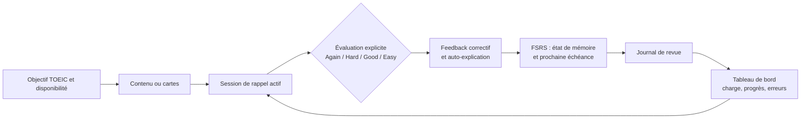

# Refonte de Mentor Evolution — apprentissage fondé sur les preuves

**Auteur : Manus AI**  
**Statut : plan d’implémentation de la première itération**  
**Date : 11 août 2026**

## Intention produit

Mentor Evolution doit devenir un **coach personnel d’apprentissage pour le TOEIC**, et non une vitrine d’« IA & neurosciences ». Le produit guide une boucle concrète : définir un objectif, étudier une notion, la rappeler sans aide, recevoir un feedback correctif, programmer la prochaine récupération, puis observer les progrès et la charge de travail. La personnalisation se base sur les performances réellement observées, les objectifs et la disponibilité — jamais sur des « styles d’apprentissage ».

> **Principe de vérité.** Chaque chiffre affiché doit venir soit des données de l’utilisateur, soit d’un calcul local décrit ; toute fonctionnalité heuristique ou expérimentale doit être étiquetée comme telle.

## Audit synthétique

| Domaine | État observé | Effet sur l’utilisateur | Priorité |
|---|---|---|---|
| Socle technique | React 18/Vite et Flask/SQLAlchemy sont opérationnels ; le lint, le build et 19 tests backend passent. | Base saine à faire évoluer sans réécriture de framework. | Maintenir |
| Expérience principale | `App.jsx` concentre près de 800 lignes et affiche des scores, recommandations, groupes, prédictions et appels à l’action en grande partie figés. | Risque de confusion entre démonstration et données personnelles. | Élevée |
| Répétition espacée | L’API applique un SM-2 modifié, mais le pipeline produit un calendrier identique `[1, 3, 7, 14, 30]` pour tous les concepts. | La planification ne reflète ni les réponses ni l’historique individuel. | Élevée |
| Validation Feynman | L’écran de validation utilise par défaut le concept factice `concept_ui`; des cases cochées et une confiance auto-déclarée contribuent au score. | La maîtrise peut être déclarée sans exercice de récupération ni concept sélectionné. | Élevée |
| Traçabilité | La carte conserve des agrégats, pas de journal de chaque revue ni d’état de planification versionné. | Impossible d’expliquer ou d’optimiser proprement le calendrier. | Élevée |
| Documentation / déploiement | Les migrations Alembic existent. Le paquet frontend déclare toutefois huit vulnérabilités dans l’audit npm, et `pytest` n’est pas déclaré parmi les dépendances de développement. | Dette de maintenance et de sécurité à traiter méthodiquement. | Moyenne |

## Décisions de conception

| Décision | Justification | Limite assumée |
|---|---|---|
| Adopter **FSRS** via le paquet Python `fsrs` 6.3.2 (MIT, Python ≥ 3.10). | FSRS formalise par carte la récupérabilité, la stabilité et la difficulté, ainsi qu’une rétention cible ; il est conçu pour exploiter l’historique de révision. [1] [2] | Les poids seront ceux du paquet par défaut. L’optimisation personnalisée ne sera pas activée sans historique suffisant et explication à l’utilisateur. |
| Créer un **journal de revue** persistant. | Les optimisations futures et l’explication des décisions exigent plus que des compteurs cumulés. [1] | La première version ne traite pas de données biométriques, de chronotype ni de diagnostics cognitifs. |
| Préserver le contrat SM-2 pendant la migration. | Les cartes existantes doivent rester consultables et la transition doit être réversible. | La logique legacy sera dépréciée, pas supprimée immédiatement. |
| Structurer la pratique autour du rappel actif et du feedback. | La récupération espacée a un fort avantage face à la récupération massée ; l’auto-explication guidée est une intervention prometteuse. [3] [4] | L’application ne garantit ni score TOEIC ni résultat pédagogique individuel. |
| Distinguer explicitement source, règle et prédiction. | Pour l’apprentissage des L2, le type de pratique, le feedback et le délai de rétention modèrent les effets de l’espacement. [5] | Les recommandations restent des aides pédagogiques et non des prescriptions médicales ou neuroscientifiques. |

## Architecture cible de la boucle d’apprentissage

### Persistance proposée

| Entité | Évolution | Rôle |
|---|---|---|
| `User` | `desired_retention` entre 0,80 et 0,97, défaut 0,90. | Choix transparent entre volume de révisions et niveau de souvenir visé. |
| `Card` | `scheduler_type`, `scheduler_state` (JSON FSRS), `scheduler_version`. | État de planification sérialisé et migrable sans casser les champs SM-2 existants. |
| `ReviewLog` | Nouvelle entité reliée à une carte et un utilisateur : note, temps de réponse, état prévisionnel, état suivant, date et version d’algorithme. | Audit, analytics, diagnostic d’erreurs et optimisation ultérieure. |

### API proposée

| Route | Changement | Compatibilité |
|---|---|---|
| `POST /api/spaced-repetition/review-card` | Accepte une note explicite `again`, `hard`, `good` ou `easy`; accepte encore `quality_response` 0–5 et le convertit. Retourne l’échéance et des éléments explicatifs. | Oui |
| `GET /api/spaced-repetition/get-due-cards` | Retourne les cartes avec l’état de planification et la charge estimée. | Oui |
| `GET/PUT /api/spaced-repetition/settings` | Lit et valide la rétention cible de l’utilisateur. | Nouvelle route |
| `GET /api/spaced-repetition/performance-analytics` | Agrège les journaux par résultat et par matière, sans fausse « prédiction IA ». | Extension rétrocompatible |

## Périmètre de la première itération

Cette itération livre le noyau utile : une révision véritablement active, une planification FSRS documentée, des données réelles sur l’écran principal et une vue d’analytics sobre. Elle ne prétend pas intégrer un assistant conversationnel distant, du mentorat humain, des groupes d’étude ou une prédiction de score TOEIC ; ces modules actuellement décoratifs seront soit reliés à des données réelles lors d’itérations ultérieures, soit présentés comme indisponibles.

Les exercices visés sont la carte à réponse libre, le texte à trous, la dictée et le choix justifié avec feedback. Cette sélection transpose les types de pratique interactive pertinents recensés notamment par H5P, sans intégrer de code H5P dans cette livraison. [6]

## Feuille de route

| Étape | Livrable | Critère d’acceptation |
|---|---|---|
| 1. Migration SRS | Schéma Alembic, état FSRS et journaux de revue. | `upgrade`/`downgrade` documentés ; carte legacy lisible. |
| 2. Moteur transparent | Adaptateur FSRS, conversion legacy, rétention cible, tests unitaires. | Les quatre notes planifient une échéance valide et un journal est créé. |
| 3. Session de rappel | Écran de révision : réponse masquée, révélation, note clavier/clic, feedback et prochaine échéance. | Aucun score de carte affiché ne provient de données statiques. |
| 4. Tableau personnel | Nombre de révisions dues, charge, résultats, concepts à consolider et méthode expliquée. | Les indicateurs correspondent aux API et affichent un état vide utile. |
| 5. Hygiène | Tests, lint, build, migration de dépendances et audit de vulnérabilités documenté. | Les contrôles du dépôt repassent ; risques restants consignés. |

## Risques et garde-fous

Les « styles d’apprentissage » ne seront pas utilisés comme mécanisme de personnalisation : la méta-analyse récente conclut que les effets de l’appariement entre styles et instruction sont trop faibles et rares pour une adoption généralisée. [7] Le label « neurosciences » sera remplacé, dans l’interface, par **méthodes d’apprentissage fondées sur les preuves**. Les sources scientifiques seront accessibles dans l’application et dans la documentation.

## Références

[1] [Anki FAQ — *What spaced repetition algorithm does Anki use?*](https://faqs.ankiweb.net/what-spaced-repetition-algorithm)  
[2] [Py-FSRS 6.3.2 — package Python MIT](https://pypi.org/project/fsrs/)  
[3] [Latimier, Peyre & Ramus (2021) — méta-analyse de la récupération espacée](https://link.springer.com/article/10.1007/s10648-020-09572-8)  
[4] [Bisra et al. (2018) — méta-analyse de l’auto-explication](https://link.springer.com/article/10.1007/s10648-018-9434-x)  
[5] [Kim & Webb (2022) — pratique espacée en langue seconde](https://onlinelibrary.wiley.com/doi/abs/10.1111/lang.12479)  
[6] [H5P — types de contenus interactifs](https://h5p.org/content-types-and-applications)  
[7] [Clinton-Lisell & Litzinger (2024) — méta-analyse des styles d’apprentissage](https://www.frontiersin.org/journals/psychology/articles/10.3389/fpsyg.2024.1428732/full)
